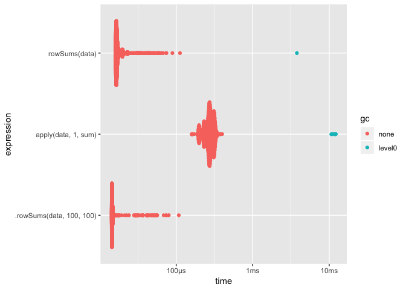
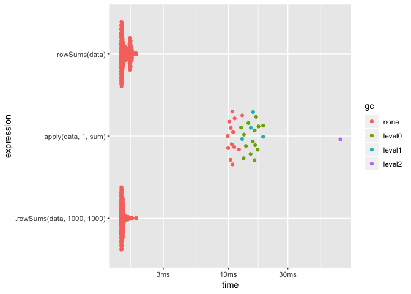
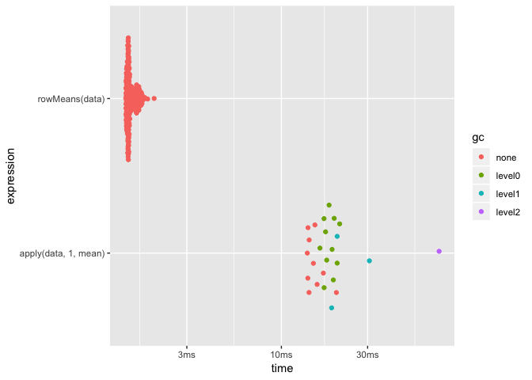
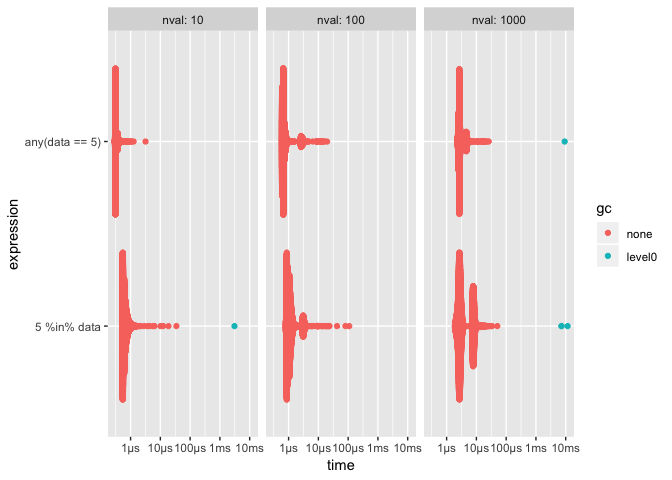

# Slow R patterns

``` r
library(magrittr)
```

This document serves as a starting point for code optimizations. It
includes possible optimization strategies.

All code here is being benchmarked using the
[bench](http://bench.r-lib.org/) package.

## For loops vs apply

Imagine you have a matrix of numbers and you want to compute the
row-wise variance. This can be done using a for loop, or using the apply
function. You will most likely not see any big speed improvements, but
the lines of codes can sometimes be considerably be improved.

``` r
data <- matrix(rnorm(100000), nrow = 1000)

rowVars <- function(x) {
  x_length <- nrow(x)
  res <- numeric(x_length)
  for (i in seq_len(x_length)) {
    res[i] <- var(x[i, ])
  }
  res
}

bench::mark(
  rowVars(data),
  apply(data, 1, var)
)
```

    ## # A tibble: 2 x 10
    ##   expression    min   mean median    max `itr/sec` mem_alloc  n_gc n_itr
    ##   <chr>      <bch:> <bch:> <bch:> <bch:>     <dbl> <bch:byt> <dbl> <int>
    ## 1 rowVars(d… 27.7ms 27.9ms 27.9ms 28.1ms      35.8    5.47MB    15     2
    ## 2 apply(dat… 28.7ms 28.7ms 28.7ms 28.7ms      34.9    2.02MB    14     2
    ## # … with 1 more variable: total_time <bch:tm>

## Apply Sums

If you are about to use `apply` with `FUN = mean` or `sum` you might
take a look at `rowSums`, `colsums`, `rowMeans` and `colMeans`. They
will do the same but faster (NaN and NA are handled slightly different
to tread lightly). the `.rowSums` is a faster variant that only works on
numeric matrices and do not name the result.

``` r
data <- matrix(rnorm(10000), nrow = 100, ncol = 100)

bench::mark(
  apply(data, 1, sum),
  rowSums(data),
  .rowSums(data, 100, 100)
) %>% plot()
```

<!-- -->

``` r
data <- matrix(rnorm(1000000), nrow = 1000, ncol = 1000)

bench::mark(
  apply(data, 1, sum),
  rowSums(data),
  .rowSums(data, 1000, 1000)
) %>% plot()
```

<!-- -->

``` r
bench::mark(
  apply(data, 1, mean),
  rowMeans(data)
) %>% plot()
```

<!-- -->

## sapply vs vapply

``` r
bench::mark(
  sapply(mtcars, sum),
  vapply(mtcars, sum, FUN.VALUE = numeric(1))
) %>% plot()
```

<!-- -->

## any all function

If you want to see if a vector contains a value, using `any(data == 10)`
can be faster then `10 %in% data`. The speed will depend on the length
of your vector and how frequent the value is.

``` r
bench::press(
  nval = c(10, 100, 1000),
  {
    data <- rpois(nval, 1)
    bench::mark(
      5 %in% data,
      any(data == 5)
    )
  }
) %>% print() %>% plot()
```

    ## Running with:
    ##    nval

    ## 1    10

    ## 2   100

    ## 3  1000

    ## # A tibble: 6 x 15
    ##   expression  nval      min     mean   median      max `itr/sec` mem_alloc
    ##   <chr>      <dbl> <bch:tm> <bch:tm> <bch:tm> <bch:tm>     <dbl> <bch:byt>
    ## 1 5 %in% da…    10    520ns 670.75ns    614ns  34.59µs  1490880.        0B
    ## 2 any(data …    10    290ns 332.44ns    311ns   3.18µs  3008068.        0B
    ## 3 5 %in% da…   100    798ns   1.25µs   1.01µs 108.67µs   801881.    1.27KB
    ## 4 any(data …   100    593ns 917.43ns    666ns  19.68µs  1089998.      448B
    ## 5 5 %in% da…  1000   1.89µs   4.32µs   2.82µs  50.53µs   231730.   11.81KB
    ## 6 any(data …  1000    2.3µs   2.98µs   2.68µs  25.96µs   335391.    3.95KB
    ## # … with 7 more variables: n_gc <dbl>, n_itr <int>, total_time <bch:tm>,
    ## #   result <list>, memory <list>, time <list>, gc <list>

<!-- -->

## cut vs findInterval

Many times when you want to use `cut`, to split a vector into bins, it
will be faster to replace cut with findInterval as it does less work by
not creating a factor.

``` r
x <- rnorm(10000)
bench::mark(check = FALSE,
  cut(x, c(-Inf, 0, Inf)),
  findInterval(x, c(-Inf, 0, Inf))
) %>%  print() %>% plot()
```

    ## # A tibble: 2 x 14
    ##   expression     min    mean  median   max `itr/sec` mem_alloc  n_gc n_itr
    ##   <chr>      <bch:t> <bch:t> <bch:t> <bch>     <dbl> <bch:byt> <dbl> <int>
    ## 1 cut(x, c(…   472µs 528.2µs 518.2µs 748µs     1893.     370KB    11   827
    ## 2 findInter…  87.4µs  98.4µs  95.1µs 221µs    10162.      48KB     7  4767
    ## # … with 5 more variables: total_time <bch:tm>, result <list>,
    ## #   memory <list>, time <list>, gc <list>

<!-- -->

## unlist

`unlist` can be be speed up by setting `use.names = FALSE`, this will
stop the returned object from being names, saving time.

``` r
bench::mark(check = FALSE,
  unlist(mtcars),
  unlist(mtcars, use.names = FALSE)
)
```

    ## # A tibble: 2 x 10
    ##   expression     min    mean  median     max `itr/sec` mem_alloc  n_gc
    ##   <chr>      <bch:t> <bch:t> <bch:t> <bch:t>     <dbl> <bch:byt> <dbl>
    ## 1 unlist(mt… 46.86µs 50.28µs 47.99µs 137.3µs    19889.    5.59KB     2
    ## 2 unlist(mt…  1.93µs  2.54µs  2.26µs  35.9µs   393688.     2.8KB     1
    ## # … with 2 more variables: n_itr <int>, total_time <bch:tm>

## cumulative function and other math group functions

If you have any mathematical calculations you need to have done, it is
worth your time to check if they are implemented in R already `?Math`.

## How many times does Y appear in X

Here we have some object which could be a vector, matrix or array. we
would like to know how many times the number 0 appear.

``` r
x_vector <- rpois(10000, 1)

bench::mark(
  unname(table(x_vector)["0"]),
  sum(x_vector == 0)
)
```

    ## # A tibble: 2 x 10
    ##   expression     min    mean  median   max `itr/sec` mem_alloc  n_gc n_itr
    ##   <chr>      <bch:t> <bch:t> <bch:t> <bch>     <dbl> <bch:byt> <dbl> <int>
    ## 1 "unname(t… 553.2µs 641.2µs 650.2µs 940µs     1560.     722KB    18   650
    ## 2 sum(x_vec…  26.3µs  29.4µs  29.5µs  78µs    33968.    39.1KB    13  9987
    ## # … with 1 more variable: total_time <bch:tm>

## table vs tabulate

If you need counts of integer-valued vectors, you will gain a big
speedup by using the `tabulate()` function. Notice that tabulate will
ignore non-positive integers, so 0s would not be counted. tabulate will
manually place the number of counts of 8 in the 8th place in its output.

``` r
x <- sample(1:10, 1000, TRUE)

table(x)
```

    ## x
    ##   1   2   3   4   5   6   7   8   9  10 
    ## 118  84  98  95 101 117  90  83  98 116

``` r
tabulate(x)
```

    ##  [1] 118  84  98  95 101 117  90  83  98 116

``` r
bench::mark(check = FALSE,
  table(x),
  tabulate(x)
)
```

    ## # A tibble: 2 x 10
    ##   expression      min     mean   median     max `itr/sec` mem_alloc  n_gc
    ##   <chr>      <bch:tm> <bch:tm> <bch:tm> <bch:t>     <dbl> <bch:byt> <dbl>
    ## 1 table(x)   107.91µs 121.58µs 119.47µs 245.4µs     8225.    67.3KB     9
    ## 2 tabulate(…   3.55µs   3.95µs   3.91µs  30.5µs   253205.        0B     0
    ## # … with 2 more variables: n_itr <int>, total_time <bch:tm>

## Using pipes

Use of the pipe operator `%>%` can make your code more readable, but it
will also result in (slightly) slower code. If speed is very important
you might want to reconsider using pipes. This will be a trade-off
between readability and speed.

``` r
library(magrittr)
x <- rpois(1000, 1)

bench::mark(
  x %>% identity(),
  identity(x)
) %>% 
  print() %>% 
  plot()
```

    ## # A tibble: 2 x 14
    ##   expression     min    mean  median      max `itr/sec` mem_alloc  n_gc
    ##   <chr>      <bch:t> <bch:t> <bch:t> <bch:tm>     <dbl> <bch:byt> <dbl>
    ## 1 x %>% ide…  41.1µs  47.2µs  46.5µs 157.13µs    21175.      280B    11
    ## 2 identity(…   178ns 206.8ns   198ns   3.98µs  4836663.        0B     0
    ## # … with 6 more variables: n_itr <int>, total_time <bch:tm>,
    ## #   result <list>, memory <list>, time <list>, gc <list>

<!-- -->

## Summing weights

``` r
x <- matrix(rnorm(1000), ncol = 1)
w <- matrix(rnorm(10000), ncol = 10)

bench::mark(
  t(x) %*% w,
  crossprod(x, w)
)
```

    ## # A tibble: 2 x 10
    ##   expression    min   mean median    max `itr/sec` mem_alloc  n_gc n_itr
    ##   <chr>      <bch:> <bch:> <bch:> <bch:>     <dbl> <bch:byt> <dbl> <int>
    ## 1 t(x) %*% w 16.4µs 19.8µs 19.7µs 61.7µs    50634.    7.86KB     1  9999
    ## 2 crossprod… 13.5µs 14.1µs 13.9µs   72µs    70965.        0B     0 10000
    ## # … with 1 more variable: total_time <bch:tm>

## pmax and pmin

pmin is a nice shorthand, but you can gain some speed with some
rewriting.

``` r
x <- runif(1000, -0.5)

bench::mark(
  pmax(x, 0),
  {
    i <- x < 0
    x[i] <- 0
    x
  }
)
```

    ## # A tibble: 2 x 10
    ##   expression    min   mean median    max `itr/sec` mem_alloc  n_gc n_itr
    ##   <chr>      <bch:> <bch:> <bch:> <bch:>     <dbl> <bch:byt> <dbl> <int>
    ## 1 pmax(x, 0) 6.19µs 8.34µs 7.73µs 43.5µs   119937.    7.86KB     2  9998
    ## 2 {...       2.75µs 3.68µs 3.49µs 30.4µs   271524.   17.16KB     1  9999
    ## # … with 1 more variable: total_time <bch:tm>

## lm

If you are doing linear regression, and you already have the data as
matrices you can benefit greatly from using the `.lm.fit` function. This
function will not do any checking for you. Just the calculations.

``` r
y <- mtcars$mpg

x <- as.matrix(mtcars[, c("disp", "cyl")])

bench::mark(check = FALSE,
  lm(mpg ~ disp + cyl - 1, mtcars),
  .lm.fit(x, y)
)
```

    ## # A tibble: 2 x 10
    ##   expression      min     mean   median   max `itr/sec` mem_alloc  n_gc
    ##   <chr>      <bch:tm> <bch:tm> <bch:tm> <bch>     <dbl> <bch:byt> <dbl>
    ## 1 lm(mpg ~ … 400.31µs 457.19µs  460.5µs 778µs     2187.  473.95KB     8
    ## 2 .lm.fit(x…   2.15µs   2.67µs   2.49µs 102µs   375298.    3.95KB     1
    ## # … with 2 more variables: n_itr <int>, total_time <bch:tm>

## using : for creating sequences

Creating a sequence from 1 to n.

``` r
n <- 100000

bench::mark(
  seq(1, n),
  seq.int(1, n),
  1:n,
  seq_len(n)
)
```

    ## # A tibble: 4 x 10
    ##   expression      min     mean   median     max `itr/sec` mem_alloc  n_gc
    ##   <chr>      <bch:tm> <bch:tm> <bch:tm> <bch:t>     <dbl> <bch:byt> <dbl>
    ## 1 seq(1, n)    3.01µs   3.56µs   3.46µs 58.15µs   280502.        0B     1
    ## 2 seq.int(1…    221ns 308.42ns    244ns  2.37µs  3242356.        0B     0
    ## 3 1:n           109ns 156.69ns    122ns  2.06µs  6381865.        0B     0
    ## 4 seq_len(n)     83ns 127.26ns     97ns 27.14µs  7857978.        0B     0
    ## # … with 2 more variables: n_itr <int>, total_time <bch:tm>

Not only is `seq_len()` faster, but it is also safer as it as it works
well when `n = 0`.

``` r
1:0
```

    ## [1] 1 0

``` r
seq_len(0)
```

    ## integer(0)
