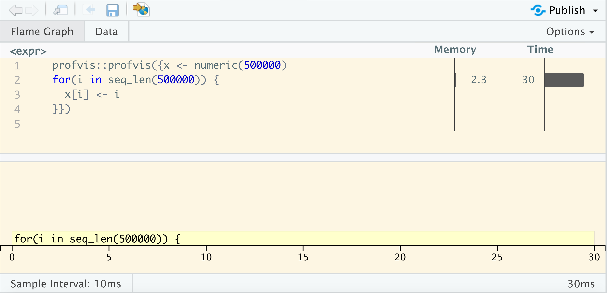

```{r include=FALSE}
library(knitr)
hook_output <- knit_hooks$get("output")
knit_hooks$set(output = function(x, options) {
  lines <- options$output.lines
  if (is.null(lines)) {
    return(hook_output(x, options))  # pass to default hook
  }
  x <- unlist(strsplit(x, "\n"))
  more <- "..."
  if (length(lines) == 1) {        # first n lines
    if (length(x) > lines) {
      # truncate the output, but add ....
      x <- c(head(x, lines), more)
    }
  } else {
    x <- c(more, x[lines], more)
  }
  # paste these lines together
  x <- paste(c(x, ""), collapse = "\n")
  hook_output(x, options)
})
knit_hooks$set(output = function(x, options) {
  # this hook is used only when the linewidth option is not NULL
  if (!is.null(n <- options$linewidth)) {
    x = knitr:::split_lines(x)
    # any lines wider than n should be wrapped
    if (any(nchar(x) > n)) x = strwrap(x, width = n)
    x = paste(x, collapse = '\n')
  }
  hook_output(x, options)
})
opts_chunk$set(
  echo = TRUE,
  fig.width = 7, 
  fig.align = 'center',
  fig.asp = 0.618, # 1 / phi
  out.width = "700px")
```

## Fix performance

### Debugging

## Measure performance

### Profiling / Benchmarking

## Improve performance

### Code improvements

---

.center[
## The Art of identifying the right line(s) of code
]

--

<br>

### Identify bottlenecks

--

<br>

### Isolate problem

--

<br>

### Create reproducible example

---

.center[

]

???

Time is dynamic

---

# Debugging

<br>

> Debugging is like being the detective in a crime movie where you're also the murderer.


.right[Filipe Fortes]

---

# There are 2 types of errors

### Getting an error

.hidden[Getting a warning]  
.hidden[R crashes]  

### Don't get expected outcome

.hidden[Test failed]  
.hidden[no outcome]  

---

# There are ~~2~~ many types of errors

### Getting an error

Getting a warning  
R crashes

### Don't get expected outcome

Test failed  
no outcome

---

# Plan of attack

### google the error message

Very real chance that someone elser had the same problem you just had.

### Isolate the problem

Your problem will most likely be confined to one area of your code.

### Make it repeatable

Work towards a minimal reproducible error.

---

# Call/Ask a friend 

It can be hard to google something if you don't know the name of the thing you want or have a hard time describing it concisely.

### Problem

I have a list of numbers and I want to add each number to all the previous numbers in a list.

### Solution

> you are thinking of a cumulative sum, implemented in R as `cumsum()`.
.right[friend]

---


---


---

# Hunting tools

## traceback()

## debug()

## breakpoints

## broswer()

---

# Urn simulation

```{r}
main_function <- function(n_max, n_black, balls, n) {
  check_input(n_max, n_black, balls, n)
  x_prep <- prep_data(n_black, balls) 
  
  res <- numeric(n)
  for(i in seq_len(n)) {
    data <- simulate_data(x_prep, n_max)
    res[i] <- analyse_results(data)
  }
  res
}
```

---

```{r}
check_input <- function(n_max, n_black, balls, n) {
  if(!is.numeric(n_max)) 
    stop("`n_max` must be numeric.")
  if(!is.numeric(n_black)) 
    stop("`n_black` must be numeric.")
  if(!is.numeric(balls)) 
    stop("`balls` must be a numeric.")
  if(!is.numeric(n)) 
    stop("`n` must be a numeric.")
  
    if(length(n_max) != 1) 
    stop("`n_max` must have length 1.")
  if(!is.numeric(n_black)) 
    stop("`n_black` must have length 1.")
  if(!is.numeric(n)) 
    stop("`n` must have length 1.")
}
```

---

```{r}
prep_data <- function(n_black, balls) {
  c(rep(0, n_black), ball_create(balls))
}

ball_create <- function(balls) {
  ball_id <- seq_len(balls)
  res <- numeric()
  for(i in ball_id) {
    res <- c(res, rep(ball_id[i], balls[i]))
  }
  res
}
```

```{r}
simulate_data <- function(urn, n_max) {
  for (j in length(urn):n_max) {
    draw <- sample(urn, 1)
    if(draw == 0) {
      urn <- c(urn, max(urn) + 1)
    } else {
      urn <- c(urn, draw)
    }  
  }
  urn
}
```

```{r}
analyse_results <- function(x) sum(x == 1)
```

---


```{r, eval=FALSE}
options(warn = 2)
main_function(n_max = 50, n_black = 1, balls = c(1, 1), n = 100)
traceback()
```
```{r, echo=FALSE}
cat(paste(sep = "\n",
'7: doWithOneRestart(return(expr), restart)',
'6: withOneRestart(expr, restarts[[1L]])',
'5: withRestarts({',
'       .Internal(.signalCondition(simpleWarning(msg, call), msg, ',
'           call))',
'       .Internal(.dfltWarn(msg, call))',
'   }, muffleWarning = function() NULL)',
'4: .signalSimpleWarning("first element used of `length.out` argument", ',
'       quote(seq_len(balls))) at #2',
'3: ball_create(balls) at #2',
'2: prep_data(n_black, balls) at #3',
'1: main_function(n_max = 50, n_black = 1, balls = c(1, 1), n = 100)'
))
```

---

# Using browser() and breakpoints

<br>
<br>

.center[
.large[
# Live Demo
]
]
.center[
urn_code.R
]

???

Using browser inside urn code
Show conditional browser

---

## debug() and debugonce() 


```{r, eval=FALSE}
debug(ball_create)
main_function(n_max = 50, n_black = 1, balls = c(1, 1), n = 100)

debugonce(simulate_data)
main_function(n_max = 50, n_black = 1, balls = c(1, 1), n = 100)
```

---

# Write tests for your code

<br>

## For every fixed bug

---

# Benchmarking

<br>

> Don't fix something that is running fast enough.
.right[Unknown]

---

# 2 types of benchmarking

## Slow (time > 1 sec)

`system.time()`  

*tictoc* package

## Fast (time < 1 sec)

Microbenchmarking  
*bench* package

---

# Timing slow code

```{r}
fibonacci <- function(n) {
  if(n == 0) {
    return(0)
  }
  if(n == 1) {
    return(1)
  }
  fibonacci(n - 1) + fibonacci(n - 2)
}
```

--

```{r}
system.time(
  fibonacci(30)
)
```

---

# Timing slow code

```{r}
fibonacci <- function(n) {
  if(n == 0) {
    return(0)
  }
  if(n == 1) {
    return(1)
  }
  fibonacci(n - 1) + fibonacci(n - 2)
}
```

```{r}
system.time(
  fibonacci(1)
)
```

---

# tictoc package for timing

```{r}
library(tictoc)

tic()
X <- fibonacci(5)
toc()
```

```{r}
tic("fibonacci with n = 5")
X <- fibonacci(5)
toc()
```


---

# tictoc package for timing

```{r, results='hold'}
library(tictoc)

tic("Total")
  tic("n = 4")
  X <- fibonacci(4)
  toc()
  
  tic("n = 5")
  X <- fibonacci(5)
  toc()
  
  tic("n = 6")
  X <- fibonacci(6)
  toc()
toc()
```

---

# Microbenchmarking with bench package

.center[
.large[
# Live Demo
]
]

???

library(magrittr)
x <- runif(100)

bench::mark(
  sqrt(x),
  x ^ 0.5,
  x ^ (1 / 2)
) %>% plot()

---

# Notice the units

- 1 ms, then one thousand calls takes a second.
- 1 µs, then one million calls takes a second.
- 1 ns, then one billion calls takes a second.

---

# Profiling

<br>

> Never mess with someone who has more spare time than you do[.]

.right[Fredrik Backman, My Grandmother Asked Me to Tell You She's Sorry]

---

<br>

.center[
.large[
# Live Demo
]
]

.center[
urn_profile.R
]

---

# Profiler information

R uses a sampling/statistical profiler  

### Memory  
left - allocated  
right - freed

---

# `<GC>` Garbage collection

Indication lots of small objects are being created

```{r, eval=FALSE}
x <- numeric(50000)
for(i in seq_len(50000)) {
  x <- c(x, i)
}
```

### R uses copy-on-modify

???
R has a variable-sized workspace.  
R maintains separate areas for fixed and variable sized objects.  
350k cons cells and 6Mb of vector heap

a name "has" an object  
 `rm("x")` doesn't remove the object, it removes the name  
(the gc then cleans up the underlying object if it detects no 'names' point to that object later on)

---


???
R has a variable-sized workspace.  
R maintains separate areas for fixed and variable sized objects.  
350k cons cells and 6Mb of vector heap

a name "has" an object  
 `rm("x")` doesn't remove the object, it removes the name  
(the gc then cleans up the underlying object if it detects no 'names' point to that object later on)

---



???
R has a variable-sized workspace.  
R maintains separate areas for fixed and variable sized objects.  
350k cons cells and 6Mb of vector heap

a name "has" an object  
 `rm("x")` doesn't remove the object, it removes the name  
(the gc then cleans up the underlying object if it detects no 'names' point to that object later on)

---

# flexibility and functionality > speed

```{r}
var
```

---

```{r echo=FALSE, fig.align = "center", dpi = 320, fig.height = 4, out.height = "99%"}
library(ggplot2)
tibble::tibble(type = c("small", "big", "small", rep("big", 8)),
               what = c(rep("check", 2), rep("calculation", 9))) %>%
  ggplot(aes(type, fill = what)) +
  geom_bar() +
  coord_flip() +
  theme_minimal() +
  labs(y = "time", x = "", title = "Check is near-constant in time", fill = "") +
  scale_fill_manual(values = c("#0080FF", "#FF8000")) +
  theme(legend.position = "bottom")
```

---

# Code improvements

<br>

> “ The first 90% of the code accounts for the first 90% of the development time. The remaining 10% of the code accounts for the other 90% of the development time. ”  

.right[ Tom Cargill]

---

# 4 ways to speed up code

## Buy a bigger computer

## Optimize R code

## Parallelize

## Rewrite code in c++

---

# 4 ways to speed up code

## .light[Buy a bigger computer]

## Optimize R code
    
## .light[Parallelize]

## .light[Rewrite code in c++]
---

# Pattern recogniction & trial and error

<br>

## Gain speed by doing less

<br>

More examples at https://github.com/USCbiostats/software-dev/tree/master/Slow_patterns

---

# unlist()

```{r}
list_obj <- list(a = 1, b = 2, c = 3)

bench::mark(check = FALSE,
  unlist(list_obj),
  unlist(list_obj, use.names = FALSE)
)[c("expression", "min", "mean", "max", "itr/sec")]
```

---

# table vs tabulate

```{r}
x <- sample(x = 1:6, size = 100, replace = TRUE)
```

```{r}
table(x)
tabulate(x)
```

---

```{r, fig.align = "center", dpi = 320}
bench::mark(check = FALSE,
  table(x),
  tabulate(x)
) %>% plot()
```

---

# Use matrix algebra

Calculate the magnitude of each point `sqrt(x^2 + y^2)`

```{r}
x <- matrix(rnorm(20), ncol = 2)
colnames(x) <- c("x", "y")
```

```{r}
x
```

---

# Use matrix algebra

.pull-left[
```{r}
x[, 1, drop = FALSE] + x[, 2, drop = FALSE]
```

]

.pull-right[
```{r}
y <- matrix(c(1, 1), ncol = 1)
x %*% y
```

]

---

# Use matrix algebra

```{r}
x <- matrix(rnorm(20), ncol = 2)
bench::mark(
  subset = x[, 1, drop = FALSE] + x[, 2, drop = FALSE],
  matrix = {
    y <- matrix(c(1, 1), ncol = 1)
    x %*% y
  }
)[c("expression", "min", "mean", "max", "itr/sec")]
```


---

# Use matrix algebra

```{r eval=FALSE}
bench::press(
  size = c(20, 200, 2000, 20000),
  {
    x <- matrix(rnorm(size), ncol = 2)
    bench::mark(
      matrix = {
        y <- matrix(c(1, 1), ncol = 1)
        x %*% y
      },
      subset = x[, 1, drop = FALSE] + x[, 2, drop = FALSE]
    )
  }
) %>%
  plot()
```

---

# Use matrix algebra

```{r echo=FALSE, message=FALSE, fig.align = "center", dpi = 320, cache=TRUE}
bench::press(
  size = c(20, 200, 2000, 20000),
  {
    x <- matrix(rnorm(size), ncol = 2)
    bench::mark(
      matrix = {
        y <- matrix(c(1, 1), ncol = 1)
        x %*% y
      },
      subset = x[, 1, drop = FALSE] + x[, 2, drop = FALSE]
    )
  }
) %>%
  plot()
```

---

.large[
.center[
# Size Matters
]
]

--

<br>

.center[
## Sometimes
]

--

<br>

.center[
## Always benchmark changes
]

--

<br>

.center[
## Save all attempts
]

--


