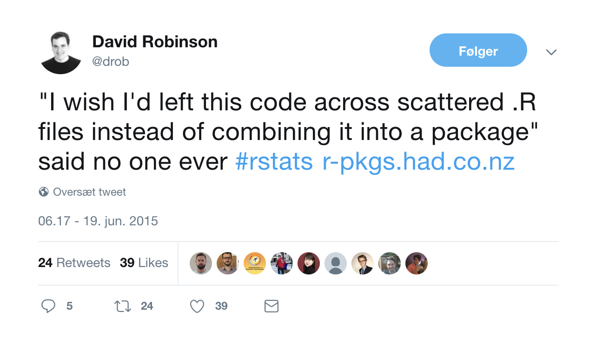
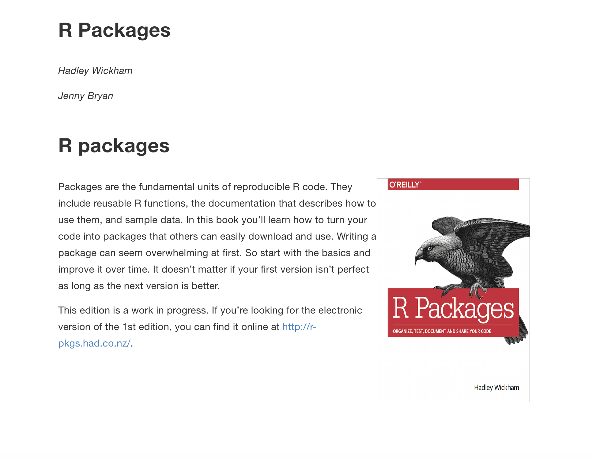
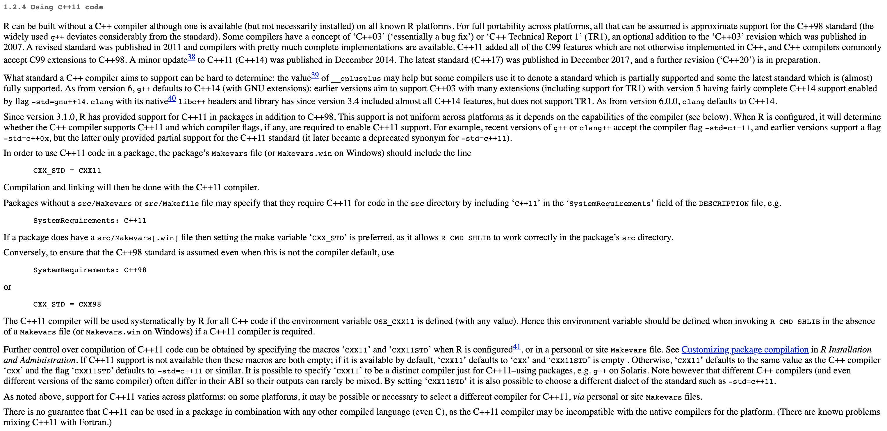
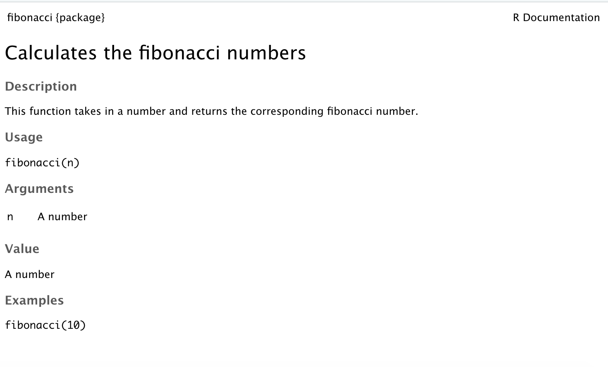

```{r include=FALSE}
library(knitr)
hook_output <- knit_hooks$get("output")
knit_hooks$set(output = function(x, options) {
  lines <- options$output.lines
  if (is.null(lines)) {
    return(hook_output(x, options))  # pass to default hook
  }
  x <- unlist(strsplit(x, "\n"))
  more <- "..."
  if (length(lines) == 1) {        # first n lines
    if (length(x) > lines) {
      # truncate the output, but add ....
      x <- c(head(x, lines), more)
    }
  } else {
    x <- c(more, x[lines], more)
  }
  # paste these lines together
  x <- paste(c(x, ""), collapse = "\n")
  hook_output(x, options)
})
knit_hooks$set(output = function(x, options) {
  # this hook is used only when the linewidth option is not NULL
  if (!is.null(n <- options$linewidth)) {
    x = knitr:::split_lines(x)
    # any lines wider than n should be wrapped
    if (any(nchar(x) > n)) x = strwrap(x, width = n)
    x = paste(x, collapse = '\n')
  }
  hook_output(x, options)
})

opts_chunk$set(
  echo = TRUE,
  fig.width = 7, 
  fig.align = 'center',
  fig.asp = 0.618, # 1 / phi
  out.width = "700px")
```

# Slides and material

Slides are up now  
https://github.com/USCbiostats/software-dev

Chapter will be up by end of week  
https://github.com/USCbiostats/handbook

---

# Overview

- Motivation
- Minimal R Package
- Not so minimal R package
- Live demo

---

# Motivation

.center[

]

---

# What is a R package?

- Packages are collections of R functions, data, and compiled code in a well-defined format.

R comes pre-installed with some packages (base packages)

```{r}
rownames(installed.packages(priority = "base"))
```

And some are loaded automatically

```{r}
getOption("defaultPackages")
```

---

# Why create a R package?

## Saving yourself time

## Sharing

## Organization

## Collaboration

## Credit

???

R packages comes with conventions so you don't have to invent the wheel

---

# Deployment

## Personal

### It never have to leave your computer

## Open-source it 

### Put it on Github/Gitlab

## CRAN / Bioconductor

???

Mention ehlib
CRAN doesn't like class specific packages
If it is not on CRAN it doesn't need to follow as strict standards.

---

# Package Manuals

## Light

https://hilaryparker.com/2014/04/29/writing-an-r-package-from-scratch/

## Medium

https://r-pkgs.org/

## Heavy

https://cran.r-project.org/doc/manuals/R-exts.html

???

Hilarys includes 1.150 words

CRAN includes 50.000 words

CRAN includes 85.000 words

---

.center[

]

---

.center[

]

---

.center[

]

---

# Getting started

You will need the following packages

```{r, eval=FALSE}
install.packages(c("devtools", "roxygen2", "testthat", "knitr"))
```

Developmental version of **devtools** and **usethis**.

```{r, eval=FALSE}
devtools::install_github("r-lib/devtools")
devtools::install_github("r-lib/usethis")
```

On Windows, download and install Rtools  
On Mac, download and install XCode  
On Linux, download and install the R development tools

???

Everything that can be automated, must be automated

---

# Creating a minimal R package - Name


Must be Googleable and avaliable.  
https://github.com/ropenscilabs/available

Can be

- Informative name, (goodpractice, microbenchmark)
- A play on words, (dplyr, strapgod, wibble)
- An Abriviation, (ergm, mcmc)
- Add an extra R, (lintr, purrr)
- No connection (shiny)

---

# Create a minimal R package


---

.pull-left[

]

.pull-right[
# We are done!
]

---

# DESCRIPTION file

```{}
Package: package
Title: What the Package Does (One Line, Title Case)
Version: 0.0.0.9000
Authors@R: 
    person(given = "Emil",
           family = "Hvitfeldt",
           role = c("aut", "cre"),
           email = "emilhhvitfeldt@gmail.com")
Description: What the package does (one paragraph).
License: MIT + file LICENSE
Encoding: UTF-8
LazyData: true
Imports:
    dplyr
Suggests:
    ggplot2
```

---

# R/ - adding functions

Create `fibonacci.R` file with `use_r("fibonacci")`

```{r}
fibonacci <- function(n) {
  if(n == 0) return(0)
  if(n == 1) return(1)
  
  fibonacci(n - 1) + fibonacci(n - 2)
}
```

---

# R/ - adding documentations

```{r}
#' Calculates the fibonacci numbers
#'
#' This function takes in a number and returns the corresponding 
#' fibonacci number.
#'
#' @param n A number
#'
#' @return A number
#' @export
#'
#' @examples
#' fibonacci(10)
fibonacci <- function(n) {
  if(n == 0) return(0)
  if(n == 1) return(1)
  
  fibonacci(n - 1) + fibonacci(n - 2)
}
```

---

```{r, eval=FALSE}
devtools::document()
```


Automatically populate the `man/` folder

---

# R/ - adding documentations

.center[

]

---

# Namespace


???

Now we are technically done with minimal package

---

# Dependencies

```{}
Package: package
Title: What the Package Does (One Line, Title Case)
Version: 0.0.0.9000
Authors@R: 
    person(given = "Emil",
           family = "Hvitfeldt",
           role = c("aut", "cre"),
           email = "emilhhvitfeldt@gmail.com")
Description: What the package does (one paragraph).
License: MIT + file LICENSE
Encoding: UTF-8
LazyData: true
Imports:
    dplyr
Suggests:
    ggplot2
```

---

# Dependencies

- `Imports` are packages that your package to work.
- `Suggests` are packages that your package can use but doesn't need.
- `LinkingTo` packages listed here rely on C or C++ code in another package.

???
Talk about number of dependencies.  
The main difference is that where `Imports` just loads the package, `Depends` attaches it.

---

# How to distribute

- Self-use

```{r, eval=FALSE}
devtools::install() # Installs locally
devtools::build()   # Creates package.tar.gz file
```

- Github + git

```{r, eval=FALSE}
usethis::use_github()
```

- CRAN

```{r, eval=FALSE}
devtools::release()
```

???

Git will not be mentioned in this talk, refer to previous and later Happy scientists and handbook.

---

# Additional components

.pull-left[
- Package name
- README
- Documentation
- Documentation website
- Authorship
- License
- Data
]

.pull-right[
- Tests
- Vignettes
- Continuous integration
- News
- codecov
- Dependencies
- Examples
]

---

# Checking

`R CMD check`

Run a bunch of sanity checks.

run

```{r, eval=FALSE}
devtools::check()
```

or Ctrl/Cmd + Shift + E in RStudio

---

# Readme

.center[

]

---

# Readme

Will generally be first point of contact for developers.

Contains:

- The package name
- Badges for continuous integration and test coverage
- Short description of goals of package
- Installation instructions
- Brief demonstration usage
- Citation information

---

# Readme - creation

Simply type

```{r, eval=FALSE}
use_readme_rmd()
```

## Workflow

- Modify
- Knit (crtl/cmd + k)
- repeat

---

# Licenses

## Officially Authorized


---

# Licenses

(I'm not a lawyer!)

- MIT (simple and permissive)
- GPL-2 or GPL-3 (anti-capitalism)   
- CC0 (freely be used for any purpose)

```{r, eval=FALSE}
use_mit_license("My Name")
use_gpl3_license("My Name")
use_cc0_license("Ny Name")
```

???

It lets people use and freely distribute your code subject to only one restriction: the license must always be distributed with the code.  

These are “copy-left” licenses. This means that anyone who distributes your code in a bundle must license the whole bundle in a GPL-compatible way. Additionally, anyone who distributes modified versions of your code (derivative works) must also make the source code available.  

It relinquishes all your rights on the code and data so that it can be freely used by anyone for any purpose. This is sometimes called putting it in the public domain, a term which is neither well-defined nor meaningful in all countries.

---

# Vignettes

Long form documentation.

Perfect for longer examples that doesn't fit in examples.

```{r, eval=FALSE}
use_vignette("Awesome vignette")
```

---

# News

More granular details regarding the changes to the package

```{r, eval=FALSE}
use_news_md()
```

---
.center[

]

---

# Data

We want to include the data generation process.

```{r, eval=FALSE}
use_data_raw()
```

In `data-raw`

```{r, eval=FALSE}
fib5 <- c(1, 1, 2, 3, 5, 8)
use_data(fib5)
```

---

# Data - documentation

Create data R file

```{r, eval=FALSE}
use_r("data")
```

Document as normal. Do not @export.

```{r, eval=FALSE}
#' First 5 fibonacci numbers
#'
#' A vector with the first 5 fibonacci numbers.
#'
#' @format A vector of length 5
"fib5"
```

---

# Compiled Code (c++)

Start by setting up package to work with compiled code

```{r, eval=FALSE}
use_rcpp()
```

Create file: File -> New File -> C++ file

- Write code
- Document with Ctrl/Cmd + Shift + D
- Build & Reload Ctrl/Cmd + Shift + B
- repeat

???

Create a src/ directory to hold your .cpp files.

Add Rcpp to the LinkingTo and Imports fields in the DESCRIPTION.

Set up a .gitignore file to make sure you don’t accidentally check in any compiled files (learn more about this in git).

Tell you the two roxygen tags you need to add to your package:

---

# Testing

Use a testing framework, we will use the testthat package

```{r, eval=FALSE}
use_testthat()
```

add a test

```{r, eval=FALSE}
use_test("fibonacci")
```

---

# Testing

```{r, eval=FALSE}
context("test-fibonacci")


test_that("fibonacci work as intended", {
  expect_equal(fibonacci(6), 8)
})


test_that("fibonacci complains when n is not numeric scalar", {
  expect_error(fibonacci("six"))
  expect_warning(fibonacci(c(1, 2, 3, 4)))
})
```

---

# Using Continuous Integration (CI)

> The idea behind continuous integration is that CI will automatically run R CMD check (along with your tests, etc.) every time you push a commit to GitHub.

```{r, eval=FALSE}
use_travis()
```

## Code coverage

```{r, eval=FALSE}
use_coverage()
```

---

# Badges


---

# Live demo

