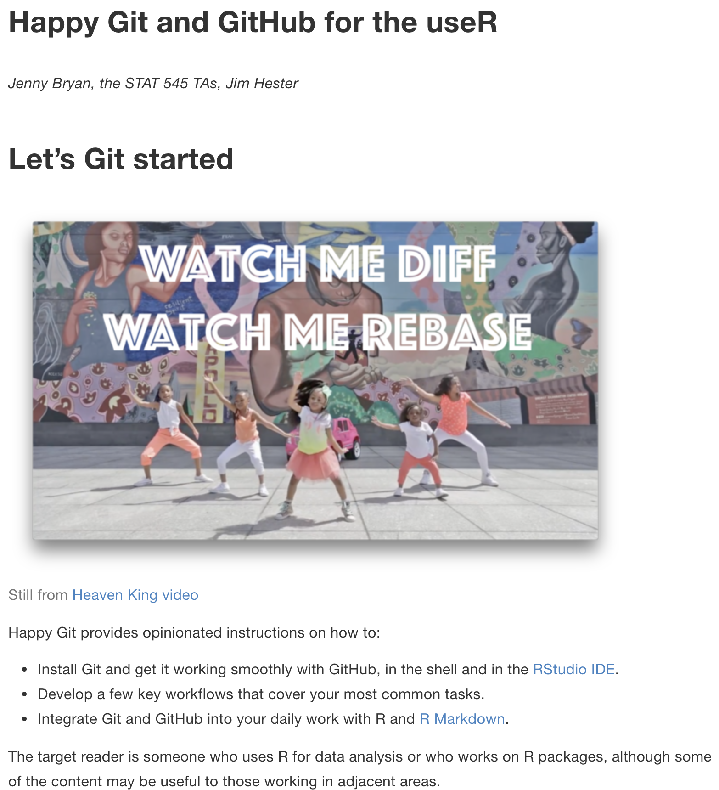
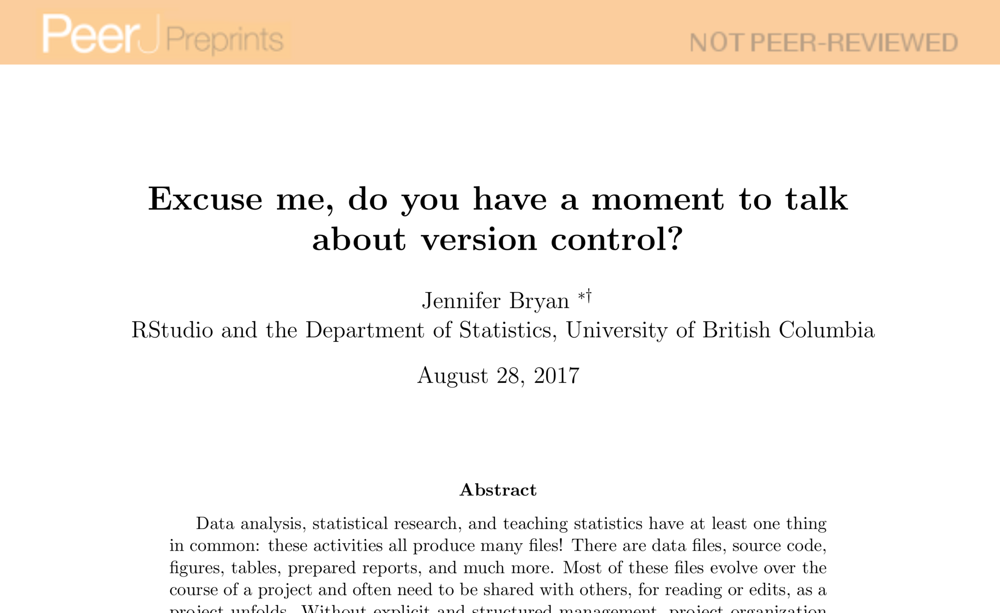
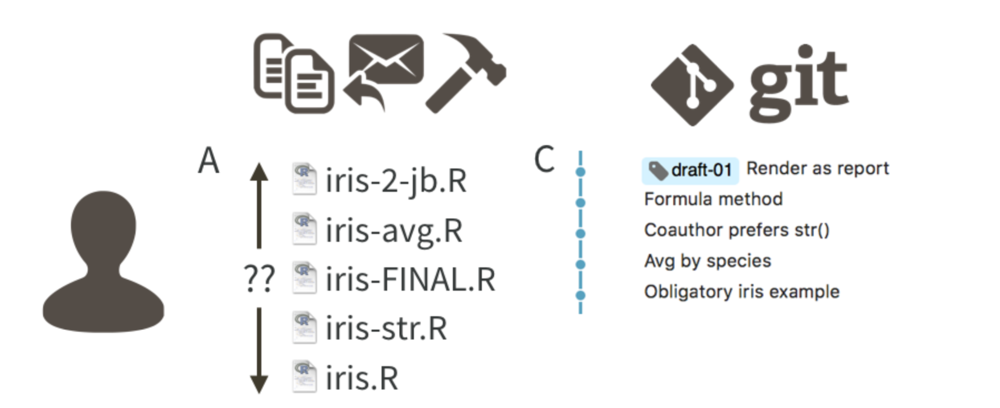
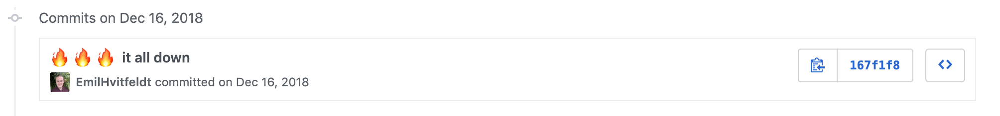
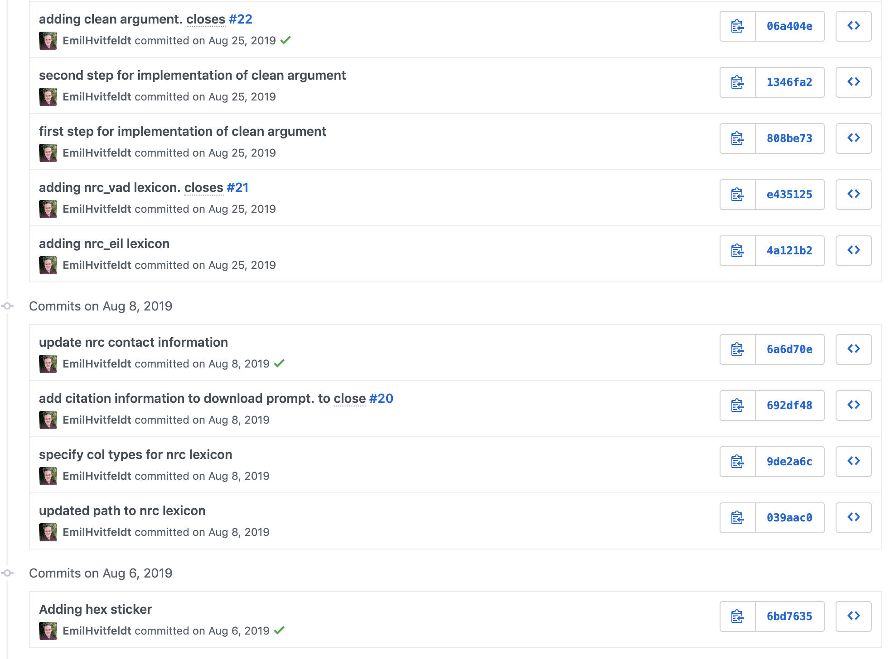

```{r include=FALSE}
library(knitr)
hook_output <- knit_hooks$get("output")
knit_hooks$set(output = function(x, options) {
  lines <- options$output.lines
  if (is.null(lines)) {
    return(hook_output(x, options))  # pass to default hook
  }
  x <- unlist(strsplit(x, "\n"))
  more <- "..."
  if (length(lines) == 1) {        # first n lines
    if (length(x) > lines) {
      # truncate the output, but add ....
      x <- c(head(x, lines), more)
    }
  } else {
    x <- c(more, x[lines], more)
  }
  # paste these lines together
  x <- paste(c(x, ""), collapse = "\n")
  hook_output(x, options)
})
knit_hooks$set(output = function(x, options) {
  # this hook is used only when the linewidth option is not NULL
  if (!is.null(n <- options$linewidth)) {
    x = knitr:::split_lines(x)
    # any lines wider than n should be wrapped
    if (any(nchar(x) > n)) x = strwrap(x, width = n)
    x = paste(x, collapse = '\n')
  }
  hook_output(x, options)
})

opts_chunk$set(
  echo = TRUE,
  fig.width = 7, 
  fig.align = 'center',
  fig.asp = 0.618, # 1 / phi
  out.width = "700px")
```

## What will this presentation be about?

--

`r emo::ji("check")` Why should you as a researcher should use Git and Github

--

`r emo::ji("cross_mark")` How to install and use Git and Github

---

.pull-left[
### happygitwithr.com

holds battle-tested instructions honed over several years in STAT 545 at the University of British Columbia.
]

.pull-right[

]

---



---

### Why should you (researcher) use Git? (and Github) 

- Collaboration is much more structured with powerful tools for asynchronous work and managing versions.
- Web presence comes with minimal effort.
- GitHub makes a fantastic course management system for courses that use R.

---

### Why should you (researcher) use Git? (and Github) 

By using common mechanics across work modes (research, teaching, analysis), you achieve basic competence quickly and avoid the demoralizing forget-relearn cycle.

A user doesn't have to be actively pushing and pull code.

---

### What is Git?

Git is a version control system. 

Git manages the evolution of a set of files – called a repository or repo – in a sane, highly structured way. 

It is like the “Track Changes” feature from Microsoft Word, but more rigorous, powerful, and scaled up to **multiple files**.

Its original purpose was to help groups of developers work collaboratively on big software projects. 

---

### What is Git?

Many people who don’t use Git unwittingly re-invent a poor man’s version of it.



---

### What is GitHub?

- Git is a  powerful structure for file management.  
- GitHub complements Git by providing a slick user interface and distribution mechanism for Git repositories. 


- Git is the software you will use locally to record changes to a set of files.   
- GitHub is a hosting service that provides a Git-aware home for such projects on the internet. 

---

### What is GitHub?

Git is the "track changes" of Microsoft Word

GitHub is like DropBox or Google Drive

--

It is easy to create a hyperlink to a specific file or location in a file, at a specific version, which can make meta-conversations about project code or reports much more productive.

GitHub also offers granular control over who can see, edit, and administer a project.

---

### GitHub Issues

Think of the issues for a project as its bug tracker.

organize our to-do list more generally.

Issues can be assigned to specific people and they can be labeled, e.g. “bug”, “simulation- study”, or “final-exam”.

Coupled with the ability to cross-link issues and the project files or file changes, you have extraordinary power to document why things have happened in the past and to organize what needs to happen in the future.

---

### Initial Setup

- Register for a free account with GitHub.
- Install Git.
- (optional) Install a local Git client.
- Confirm, with a practice repository, that local Git can send and receive the current version of the repository on GitHub, known as pushing and pulling, respectively.

---

### Repositories and Workflow

For new or existing projects, you will:
- Dedicate a local directory or folder to it.
- (Optional) Make it an RStudio Project.
- Make it a Git repository.

???

This setup happens once per project and can happen at project inception or at any later point. Chances are your project already lives in a dedicated directory. Making this directory an RStudio Project and Git repository boils down to allowing those applications to leave notes for themselves in hidden files or directories. The project is still a regular directory on your computer, that you can locate, name, move, and generally interact with as you wish. 

---

### Daily Workflow

- Go about your usual business.
- But instead of only saving individual files, periodically you make a commit.
- Push commits to GitHub periodically.

???

If you have ever versioned a file by adding your initials or the date, you have effectively made a commit, albeit only for a single file. It is a version that is significant to you and that you might want to inspect or revert to later.

– This is like sharing a document with colleagues on DropBox or sending it out as an email attachment. By pushing to GitHub, you make your work and all your accumulated progress accessible to others.

---

### Commits, Diffs, and Tags

Recall that a repository or repo is just a directory of files that Git manages holistically. 

A commit functions like a snapshot of all the files in the repo, at a specific moment.

Commits are the "most recent update v2" files you send via email.


---

### Commits, Diffs, and Tags

Commits need a message to be included.

Doesn't need to be informative but is highly recommended.

---

### Commits, Diffs, and Tags



---

### Commits, Diffs, and Tags



---

### Commits, Diffs, and Tags

https://github.com/EmilHvitfeldt/textdata/commit/e435125cb2e35615c0d14c5dd19bdbd54ed40c9f

---

### Commits, Diffs, and Tags

A **diff** is the change that happened between commits.

Diff inspection is not limited to adjacent commits. 

You can inspect the diffs between any two commits.

---

### Commits, Diffs, and Tags

You can also designate certain snapshots as special with a tag, which is a name of your choosing.

Software: "v1.0.0", "v6.3.0"

Writing: "draft-1", "draft-2", "review-1", "publication"

---

### Which files to commit

Is it useful to someone? If so, track and share!

Will it play nicely with Git/GitHub? 

`r emo::ji("check")` Small-to-medium plain text files with hard line breaks are ideal

`r emo::ji("check")` .csv and .tsv files

---

### Which files to commit

Will it actively cause problems with Git/GitHub? 


`r emo::ji("cross_mark")` A file that is large and is changing often.

`r emo::ji("cross_mark")` A file is binary, such as a Word document or Excel spreadsheet.

`r emo::ji("cross_mark")``r emo::ji("cross_mark")``r emo::ji("cross_mark")` A large binary file that changes often.

---

### Collaboration

Multiple people, including your past and future self.

Participants include

- Active workers (people who write stuff)
- People who only read and review

---

### Collaboration - Edit, save, attach

Everyone has one (or more!) copies of the document, which circulate as email attachments, accumulating initials and dates in the filename.

If you have multiple edits to the same file how do you fix it?

---

### Collaboration - Google Doc.

There is only one copy of the document and it lives in the cloud.

Anyone can edit or comment or propose a change and this is immediately available to everyone else.

Files are handled individually.

---

### Collaboration - Git & Github

Git is a decentralized version control system, meaning each collaborator has its own complete copy of the repo and its history. Everyone can work offline and/or simultaneously.

You pull regularly from GitHub, to receive and integrate changes made by your collaborators.

The joke is that GitHub puts the “central” in decentralized version control.

---

### Collaboration - Git & Github conflicts

But sometimes it’s not clear how to reconcile your changes with the new ones from GitHub and you get a **merge conflict**. 

Merge conflicts are the most frustrating thing about using Git and GitHub.

---

### Collaboration - Git & Github conflicts

At each location of conflict, you must pick one version or the other – or create a hybrid – and mark it as resolved.

Many Git clients have special tooling for this specific task, which can be very convenient.

Once you’ve resolved all conflicts, you will be able to finalize the merge and push a version integrating your recent changes to GitHub.

---

### Collaboration - Git & Github conflicts

The best way to deal with merge conflicts is to prevent them.

Everyone should commit, pull, and push often.

---

### GitHub as a Web Presence

Simply having a project on GitHub gives it a web presence! 

Non-users of Git/GitHub can visit the project in the browser and interact with it like a webpage.

GitHub also offers several ways to host a proper website directly from a repository,
collectively known as GitHub Pages. 

---

### Markdown is special on GitHub

Any file written in Markdown is rendered in an HTML-like way on GitHub.

files named README.md will be rendered as the starting page.

---

### Extra Things You Get with minimal Effort

Continuous Integration

- Travis-CI
- Appveyor
- Azure Pipelines
- Circle CI
- GitHub Actions

---

### Extra Things You Get with minimal Effort

- Codecov
- Code checking
- Webhosting

---

### Last Things

Github is not the only place. Bitbucket or GitLab

Many companies and even universities are starting to make GitHub Enterprise or GitLab available internally.
